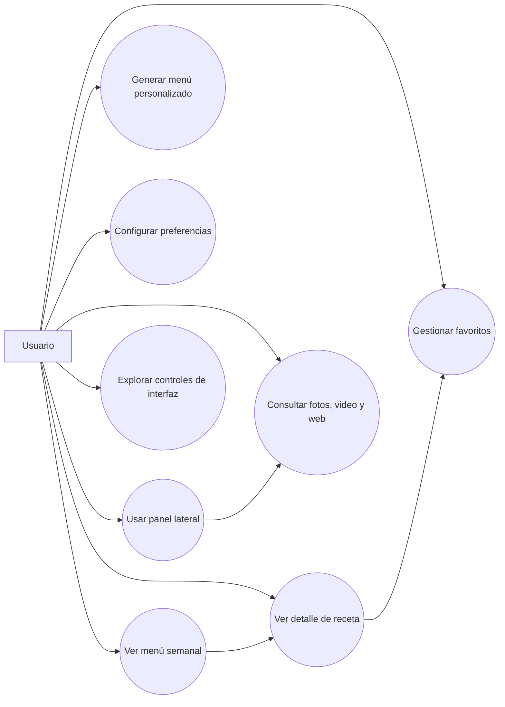
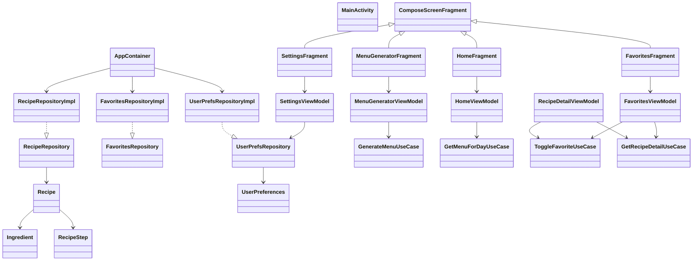
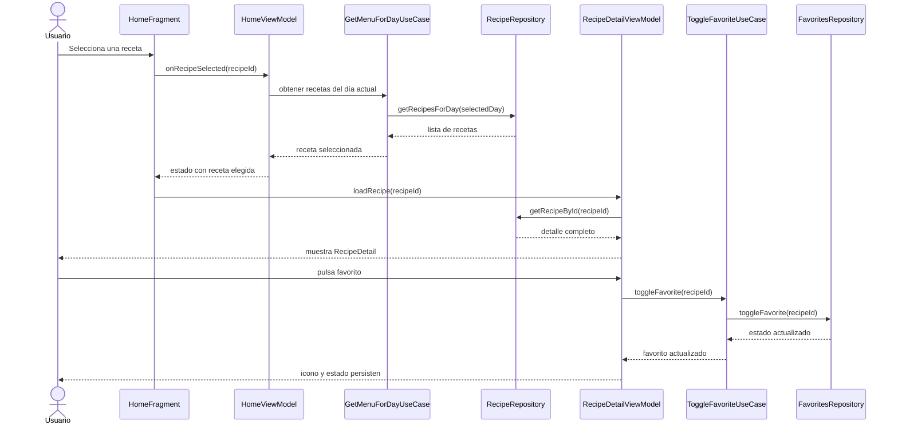

# Recipe Generator — Generador de Menús Semanales

---

## CARÁTULA

**Título de la Aplicación:**
# Recipe Generator — Generador de Menús Semanales

**Materia:** Herramientas de Programación Móvil I

**Institución:** Politécnico Grancolombiano — Bogotá, Colombia

**Programa:** Ingeniería de Sistemas

**Integrantes:**
- Omar Hernández Rey — Cód. 100349113
- Julian David Ortiz Bedoya
- Yonatan Ferney Fernández
- Juan David Rivera Casallas

**Docente:** Jose Ricardo Casallas Triana

**Grupo:** B03

**Fecha:** Marzo 2026

---

## TABLA DE CONTENIDO

1. [Título de la Aplicación](#1-título-de-la-aplicación)
2. [Descripción del Proyecto](#2-descripción-del-proyecto) *(F1-02)*
3. [Objetivo General](#3-objetivo-general) *(F1-03)*
4. [Objetivos Específicos](#4-objetivos-específicos) *(F1-04)*
5. [Requerimientos Funcionales](#5-requerimientos-funcionales) *(F1-05)*
6. [Requerimientos No Funcionales](#6-requerimientos-no-funcionales) *(F1-06)*
7. [Diagrama de Casos de Uso](#7-diagrama-de-casos-de-uso) *(F1-07)*
8. [Diagrama de Clases](#8-diagrama-de-clases) *(F1-08)*
9. [Diagrama de Secuencia](#9-diagrama-de-secuencia) *(F1-09)*
10. [Wireframes / Mockups](#10-wireframes--mockups) *(F1-10)*
11. [Referencias](#referencias)

---

## 1. Título de la Aplicación

**Recipe Generator — Generador de Menús Semanales**

La aplicación recibe el nombre **Recipe Generator**, cuya traducción al español es
**Generador de Menús Semanales**. El título refleja con precisión el propósito central
del sistema: generar, visualizar y gestionar menús de comida para cada día de la semana,
facilitando al usuario la planificación de su alimentación de forma semanal.

El nombre combina dos elementos:

- **Recipe Generator** (inglés técnico): alineado con las convenciones del ecosistema
  Android y del entorno académico de desarrollo de software, donde los nombres de
  proyectos y paquetes se escriben en inglés.
- **Generador de Menús Semanales** (español descriptivo): indica con claridad la
  funcionalidad principal para el usuario hispanohablante, que es el público objetivo
  de la aplicación.

### Identificación técnica del proyecto

| Atributo          | Valor                                      |
|-------------------|--------------------------------------------|
| Nombre completo   | Recipe Generator — Generador de Menús Semanales |
| Nombre técnico    | RecipeGenerator                            |
| Package ID        | `com.example.recipe_generator`             |
| Plataforma        | Android (API 24 — Android 7.0 Nougat en adelante) |
| UI Framework      | Jetpack Compose + Material Design 3        |
| Lenguaje          | Kotlin 2.2.10                              |
| Arquitectura      | MVVM + Clean Architecture (3 capas)        |
| Base de datos     | Room Database (SQLite local)               |
| IDE               | Android Studio Panda 2025.3.2              |

---

---

## 2. Descripción del Proyecto

### 2.1 Propósito

**Recipe Generator — Generador de Menús Semanales** es una aplicación móvil nativa para
Android desarrollada en Kotlin con Jetpack Compose y Material Design 3. Su propósito
principal es ayudar a las personas a planificar su alimentación semanal de forma
organizada, práctica y saludable, proporcionando un conjunto de recetas clasificadas
por día de la semana y por tipo de comida (desayuno, almuerzo y cena).

La aplicación busca resolver un problema cotidiano: la dificultad que enfrentan muchas
personas para decidir qué comer cada día, evitar la repetición de platos, y mantener
una dieta equilibrada sin invertir tiempo excesivo en planificación. A través de una
interfaz intuitiva y visualmente atractiva, el usuario puede explorar recetas, guardar
sus favoritas, generar menús personalizados según sus preferencias y configurar la
aplicación a su gusto.

Adicionalmente, el proyecto tiene un propósito académico: demostrar la aplicación de
conceptos fundamentales del desarrollo de aplicaciones móviles en Android, cubriendo
los lineamientos de formación LF1 a LF8 del módulo **Herramientas de Programación
Móvil I** del Politécnico Grancolombiano, con énfasis en arquitectura MVVM + Clean
Architecture, Jetpack Compose, Room Database y navegación entre pantallas.

### 2.2 Público Objetivo

La aplicación está dirigida a los siguientes perfiles de usuario:

| Perfil | Descripción |
|---|---|
| **Personas activas** | Adultos de 18 a 45 años que buscan comer saludable pero disponen de poco tiempo para planificar su menú diario. |
| **Familias** | Hogares que necesitan organizar las comidas de la semana para toda la familia, con control de ingredientes y porciones. |
| **Estudiantes** | Jóvenes universitarios que viven solos y requieren orientación para preparar comidas variadas y económicas. |
| **Deportistas** | Personas que siguen regímenes alimenticios específicos (alta proteína, baja en carbohidratos, etc.) y necesitan filtrar recetas por criterios nutricionales. |
| **Usuarios con dietas especiales** | Personas vegetarianas, veganas o con restricciones alimentarias que desean filtrar recetas según su tipo de dieta. |

El idioma principal de la interfaz es el **español**, orientado al mercado latinoamericano
y en especial al usuario colombiano, aunque la arquitectura permite agregar soporte
multiidioma (español, inglés, portugués) a través de la pantalla de Ajustes.

El dispositivo objetivo principal es el **Samsung SM-A528B** (Samsung Galaxy A52s 5G),
con Android 7.0 Nougat (API 24) como versión mínima soportada, lo que garantiza
compatibilidad con aproximadamente el **95 % de los dispositivos Android activos** en
el mercado.

### 2.3 Alcance Funcional

La versión 1.0 de **Recipe Generator** contempla las siguientes funcionalidades:

#### Funcionalidades incluidas (en alcance)

| # | Módulo | Descripción |
|---|---|---|
| 1 | **Menú Semanal** | Visualización de recetas organizadas por día (Lunes–Domingo) y tipo de comida (Desayuno, Almuerzo, Cena). |
| 2 | **Detalle de Receta** | Pantalla con imagen hero, información nutricional (calorías, proteínas, carbos, grasas), ingredientes y pasos de preparación. |
| 3 | **Favoritos** | Marcado de recetas favoritas con persistencia local (Room Database). Pantalla con búsqueda por texto y filtro por categoría. |
| 4 | **Generador de Menú** | Generación automática de menús según filtros: dificultad (Slider), tipo de comida (Dropdown) y tipo de dieta (Chips). |
| 5 | **Ajustes** | Configuración de tema claro/oscuro (Switch), idioma (RadioButton group), porciones (Spinner/Dropdown) y dietas (Checkbox). |
| 6 | **Menú lateral** | Panel izquierdo con accesos directos: Perfil, Fotos, Video, Navegador web y pantalla de Controles. |
| 7 | **Perfil de usuario** | Pantalla con imagen local e información del perfil (sin autenticación en v1.0). |
| 8 | **Galería de fotos** | LazyColumn de imágenes locales con descripción al seleccionar. |
| 9 | **Reproductor de video** | Pantalla con `VideoView` (AndroidView) para reproducción de video local con `MediaController`. |
| 10 | **Navegador web** | Pantalla con `WebView` (AndroidView), campo de URL y barra de progreso. |
| 11 | **Controles LF8** | Pantalla de demostración con todos los controles requeridos: Button, IconButton, Checkbox, RadioButton, Switch, Dropdown (Spinner), LazyColumn (ListView). |
| 12 | **Widget de escritorio** | Widget nativo Android (AppWidgetProvider) que muestra la receta del día con botón para abrir la app. |

#### Funcionalidades fuera de alcance (v1.0)

- Autenticación de usuarios (login / registro).
- Sincronización con backend en la nube o servidor externo.
- Compra de ingredientes en línea o integración con supermercados.
- Notificaciones push programadas.
- Cámara para fotografiar platos propios.
- Reconocimiento de ingredientes mediante inteligencia artificial.

### 2.4 Stack Tecnológico

El proyecto se desarrolla con la siguiente pila tecnológica, aprobada por el docente:

| Capa | Tecnología |
|---|---|
| Lenguaje | Kotlin 2.2.10 |
| UI | Jetpack Compose + Material Design 3 |
| Arquitectura | MVVM + Clean Architecture (Presentation / Domain / Data) |
| Navegación | Navigation Component — `NavHostFragment` + `main_nav_graph.xml` |
| Base de datos | Room Database (SQLite local) |
| Persistencia liviana | DataStore Preferences |
| Estado | `StateFlow` + `collectAsStateWithLifecycle()` |
| Concurrencia | Kotlin Coroutines + Flow (`viewModelScope`) |
| Build | Gradle Kotlin DSL + Version Catalog (`libs.versions.toml`) |
| SDK mínimo | API 24 — Android 7.0 Nougat |
| SDK objetivo | API 36 — Android 16 |
| IDE | Android Studio Panda 2025.3.2 |

---

## 3. Objetivo General

**Desarrollar** una aplicación móvil nativa para Android denominada
*Recipe Generator — Generador de Menús Semanales*, **mediante** la implementación
de Jetpack Compose con Material Design 3, arquitectura MVVM + Clean Architecture,
Room Database y Navigation Component, **con el fin de** proporcionar a los usuarios
una herramienta digital intuitiva que les permita planificar, visualizar y personalizar
sus menús alimenticios semanales de forma local, eficiente y sin dependencia de
servicios externos.

### Desglose estructural del objetivo general

La formulación del objetivo sigue la estructura académica estándar:

| Componente | Contenido |
|---|---|
| **Verbo infinitivo** | Desarrollar |
| **Qué** | Una aplicación móvil nativa para Android — *Recipe Generator* |
| **Cómo** | Mediante Jetpack Compose + Material Design 3, arquitectura MVVM + Clean Architecture (3 capas: Presentation / Domain / Data), Room Database como fuente de verdad local, Navigation Component para la navegación entre pantallas, StateFlow + Coroutines para el manejo del estado, y DataStore Preferences para la persistencia de configuración |
| **Para qué** | Proporcionar a los usuarios una herramienta que les permita planificar, explorar y personalizar sus menús semanales (Lunes–Domingo) de forma organizada, saludable y completamente offline |

### Justificación del objetivo

La selección de **Jetpack Compose** como framework de UI responde a la aprobación
explícita del docente y al hecho de ser la tecnología oficial recomendada por Google
para el desarrollo moderno de interfaces en Android. Este framework permite cumplir
íntegramente los lineamientos LF1 a LF8 del módulo mediante estrategias de
compatibilidad documentadas en la tabla de equivalencias del Plan Maestro v3.0
(Actividades, Fragmentos con `ComposeView`, `AndroidView{}` para controles
específicos, `LazyColumn` como equivalente de `ListView`, entre otros).

La elección de **Room Database** garantiza persistencia de datos completamente local
y sin dependencia de backend externo, lo cual es coherente con el alcance definido
para la versión 1.0 de la aplicación.

---

## 4. Objetivos Específicos

Los siguientes cinco objetivos específicos son medibles, alcanzables y están
alineados directamente con los lineamientos de formación LF1 a LF8 del módulo
*Herramientas de Programación Móvil I*.

---

### OE-01 — Implementar la arquitectura MVVM + Clean Architecture *(LF1, LF2)*

**Implementar** la arquitectura MVVM + Clean Architecture en tres capas
(Presentation, Domain, Data) **mediante** la definición de ViewModels con
`StateFlow`, casos de uso en la capa Domain, repositorios con interfaces e
implementaciones en la capa Data, y un contenedor de inyección de dependencias
manual (`AppContainer`) en la clase `Application`, **con el fin de** garantizar
una separación de responsabilidades clara, código mantenible y testeable que
demuestre el dominio de los principios de arquitectura de aplicaciones Android
modernas establecidos en LF1 y LF2.

**Indicador de cumplimiento:** La aplicación compila sin errores, las tres capas
están correctamente delimitadas en paquetes (`presentation/`, `domain/`, `data/`),
y cada ViewModel expone su estado únicamente a través de `StateFlow` inmutable.

---

### OE-02 — Construir la interfaz de usuario con Jetpack Compose y Material Design 3 *(LF3, LF4)*

**Construir** todas las pantallas de la aplicación (Menú Semanal, Detalle de Receta,
Favoritos, Generador de Menú, Ajustes y panel lateral) **mediante** Jetpack Compose
con componentes de Material Design 3 (`Scaffold`, `LazyColumn`, `LazyVerticalGrid`,
`NavigationBar`, `Card`, `TopAppBar`) y manejo de estado local con
`remember { mutableStateOf() }`, **con el fin de** ofrecer una interfaz moderna,
responsiva y consistente que cubra íntegramente los lineamientos LF3 (layouts e
interfaz) y LF4 (app interactiva con estado).

**Indicador de cumplimiento:** Cada pantalla está implementada como `@Composable`,
responde correctamente a las interacciones del usuario, y el estado visual se
actualiza de forma reactiva sin requerir `invalidate()` ni `notifyDataSetChanged()`.

---

### OE-03 — Integrar controles de interfaz requeridos por el módulo *(LF7, LF8)*

**Integrar** en la aplicación todos los controles de interfaz exigidos por los
lineamientos LF7 y LF8 **mediante** el uso de sus equivalentes modernos en
Jetpack Compose (`Slider` por `SeekBar`, `LazyColumn` por `ListView`,
`ExposedDropdownMenuBox` por `Spinner`, `Switch`, `Checkbox`, `RadioButton`,
`Button`, `IconButton`) y el uso de `AndroidView{}` para incrustar controles
nativos como `VideoView` y `WebView` dentro de Composables, **con el fin de**
demostrar el dominio y la equivalencia funcional entre los controles del framework
XML tradicional y el paradigma declarativo de Compose.

**Indicador de cumplimiento:** La pantalla `ControlsScreen` exhibe y responde
correctamente a todos los controles listados; `VideoScreen` reproduce video local
y `WebScreen` carga URLs mediante `WebView`; cada control genera una respuesta
visible en la UI al interactuar con él.

---

### OE-04 — Implementar navegación entre actividades y fragmentos *(LF5, LF6)*

**Implementar** la navegación completa de la aplicación **mediante** una
`MainActivity` como Single Activity host con `NavHost` de Navigation Compose,
una segunda actividad `RecipeDetailActivity` lanzada con `Intent.putExtra(recipeId)`
para el detalle de receta, y cada pantalla principal alojada en un `Fragment`
con `ComposeView` como host de la UI Compose, **con el fin de** cumplir
explícitamente los lineamientos LF5 (ciclo de vida de actividades, back stack,
`Intent` y `Bundle`) y LF6 (gestión de fragmentos con `FragmentManager`,
`replace()` y `addToBackStack()`).

**Indicador de cumplimiento:** La aplicación navega correctamente entre las
4 pestañas del `NavigationBar`, lanza `RecipeDetailActivity` al seleccionar
una receta, permite regresar con el botón Back, y el `FragmentManager`
gestiona el back stack de fragmentos sin fugas de memoria.

---

### OE-05 — Persistir datos localmente con Room Database y DataStore *(LF1, LF2)*

**Persistir** todas las recetas, favoritos y preferencias del usuario
**mediante** Room Database (SQLite local) para las entidades `RecipeEntity`,
`IngredientEntity` y `StepEntity`, y DataStore Preferences para la
configuración de tema, idioma, porciones y dietas, **con el fin de** garantizar
que la aplicación funcione completamente offline, que los favoritos y ajustes
del usuario se conserven entre sesiones, y que la capa de datos cumpla los
principios de fuente única de verdad (*Single Source of Truth*) del módulo.

**Indicador de cumplimiento:** Las 21 recetas (7 días × 3 comidas) se almacenan
en Room al primer inicio mediante `DatabaseSeeder`; marcar una receta como favorita
persiste en la base de datos y aparece en `FavoritesScreen` al relanzar la app;
los ajustes guardados en DataStore se restauran correctamente al reiniciar.

---

### Tabla resumen de objetivos específicos

| ID | Verbo | Qué | Cómo | LF cubierto |
|---|---|---|---|---|
| OE-01 | Implementar | Arquitectura MVVM + Clean Architecture | ViewModels, StateFlow, UseCases, AppContainer | LF1, LF2 |
| OE-02 | Construir | UI con Compose + Material Design 3 | Composables, Scaffold, LazyColumn, remember | LF3, LF4 |
| OE-03 | Integrar | Controles requeridos por el módulo | Slider, LazyColumn, Dropdown, AndroidView | LF7, LF8 |
| OE-04 | Implementar | Navegación entre Activities y Fragments | NavHost, Intent, Fragment + ComposeView | LF5, LF6 |
| OE-05 | Persistir | Datos locales con Room y DataStore | Room DB (21 recetas), DataStore Preferences | LF1, LF2 |

## 5. Requerimientos Funcionales

Los requerimientos funcionales de la aplicación se definen a continuación con foco en la
primera entrega documental y en la arquitectura ya aprobada para el proyecto.

| ID | Requerimiento funcional | Prioridad | Criterio de aceptación |
|---|---|---|---|
| RF-01 | El sistema debe permitir visualizar el menú semanal organizado por día y por tipo de comida. | Alta | El usuario puede cambiar de día y ver recetas de desayuno, almuerzo y cena en la pantalla principal. |
| RF-02 | El sistema debe permitir consultar el detalle completo de una receta. | Alta | Al seleccionar una receta se muestran imagen, tiempo, calorías, ingredientes y pasos. |
| RF-03 | El sistema debe permitir marcar y desmarcar recetas como favoritas. | Alta | El usuario puede activar o desactivar el favorito y el estado visual cambia de inmediato. |
| RF-04 | El sistema debe mostrar una pantalla exclusiva para favoritos. | Alta | Existe una vista con solo recetas favoritas y esta se actualiza al cambiar el estado de favorito. |
| RF-05 | El sistema debe permitir filtrar favoritos por texto y categoría. | Media | El usuario puede escribir una búsqueda y seleccionar categoría para reducir el listado. |
| RF-06 | El sistema debe generar un menú según preferencias del usuario. | Alta | El usuario puede combinar dificultad, tipo de comida, dietas y porciones para obtener resultados. |
| RF-07 | El sistema debe permitir configurar preferencias persistentes. | Alta | Tema, idioma, porciones y dietas se guardan y se restauran al reiniciar la aplicación. |
| RF-08 | El sistema debe incorporar un panel lateral con accesos rápidos a módulos complementarios. | Media | El usuario puede abrir opciones como perfil, fotos, video, web y controles desde el menú lateral. |
| RF-09 | El sistema debe reproducir un video local dentro de la aplicación. | Media | El módulo de video carga un recurso local y el usuario puede reproducirlo y pausarlo. |
| RF-10 | El sistema debe permitir visualizar una página web desde un `WebView`. | Media | El usuario escribe o selecciona una URL y el contenido se carga dentro de la app. |
| RF-11 | El sistema debe incluir una pantalla de demostración de controles del módulo. | Media | Se muestran y responden controles como `Button`, `Checkbox`, `RadioButton`, `Switch`, `Dropdown` y listas. |
| RF-12 | El sistema debe funcionar sin depender de servicios backend externos. | Alta | Las recetas, favoritos y preferencias pueden consultarse y modificarse con persistencia local. |

---

## 6. Requerimientos No Funcionales

| ID | Requerimiento no funcional | Tipo | Criterio verificable |
|---|---|---|---|
| RNF-01 | La aplicación debe ser compatible con Android API 24 en adelante. | Compatibilidad | El proyecto compila con `minSdk 24` y `targetSdk 36`. |
| RNF-02 | La aplicación debe mantener una experiencia completamente offline en su operación base. | Disponibilidad | Las funciones principales continúan operando sin conexión a Internet. |
| RNF-03 | La pantalla principal debe mostrarse en un tiempo máximo de 3 segundos en un dispositivo de gama media con datos locales. | Rendimiento | El usuario puede abrir la app y ver contenido inicial sin tiempos de espera prolongados. |
| RNF-04 | Las interacciones locales deben responder en menos de 300 ms para cambios de filtros y favoritos. | Rendimiento | Cambios de estado como favoritos o filtros se reflejan sin percepción de bloqueo. |
| RNF-05 | El código debe mantener separación estricta entre Presentation, Domain y Data. | Mantenibilidad | Las dependencias entre capas se conservan unidireccionales y el proyecto sigue MVVM + Clean Architecture. |
| RNF-06 | La interfaz debe ser consistente y usable en orientación vertical sobre teléfonos Android. | Usabilidad | Todas las pantallas principales son navegables y legibles sin solapamientos. |
| RNF-07 | Los controles táctiles deben respetar tamaños recomendados y contraste suficiente. | Accesibilidad | Botones, switches y elementos interactivos son visibles y accionables en pantallas móviles. |
| RNF-08 | La persistencia de favoritos y preferencias debe sobrevivir al cierre de la aplicación. | Confiabilidad | Al cerrar y abrir de nuevo, el usuario recupera su configuración y favoritos previos. |
| RNF-09 | La solución debe evitar dependencias innecesarias de terceros para carga remota de datos o imágenes. | Seguridad / mantenibilidad | La base del proyecto funciona con recursos y datos locales sin servicios externos obligatorios. |
| RNF-10 | La documentación de la Entrega 1 debe estar estructurada bajo formato académico APA. | Documentación | El documento incluye carátula, tabla de contenido, cuerpo temático y referencias. |

---

## 7. Diagrama de Casos de Uso



### Descripción resumida de casos de uso

- **CU-01 Ver menú semanal:** permite consultar las recetas por día y tipo de comida.
- **CU-02 Ver detalle de receta:** expone información ampliada de una receta específica.
- **CU-03 Gestionar favoritos:** permite agregar o quitar recetas favoritas.
- **CU-04 Generar menú personalizado:** construye propuestas de menú con filtros seleccionados.
- **CU-05 Configurar preferencias:** almacena tema, idioma, porciones y dietas.
- **CU-06 Usar panel lateral:** habilita navegación a módulos auxiliares.
- **CU-07 Consultar fotos, video y web:** cubre los componentes multimedia solicitados.
- **CU-08 Explorar controles de interfaz:** demuestra controles LF7 y LF8 dentro de Compose.

---

## 8. Diagrama de Clases



### Interpretación del diagrama

El diagrama de clases resume la arquitectura del proyecto en tres capas:

- **Presentation:** `MainActivity`, `Fragments`, pantallas Compose y `ViewModels`.
- **Domain:** casos de uso y contratos de repositorio.
- **Data:** implementaciones concretas de repositorios y persistencia local.

---

## 9. Diagrama de Secuencia



---

## 10. Wireframes / Mockups

Los siguientes wireframes de baja fidelidad representan la estructura objetivo de la UI.

### 10.1 MainScreen — NavBar + Content

```text
┌──────────────────────────────────────────────┐
│ TopAppBar: Recipe Generator                  │
├──────────────────────────────────────────────┤
│ Tabs por día: Lun Mar Mie Jue Vie Sab Dom    │
├──────────────────────────────────────────────┤
│ Lista / grid de recetas del día              │
│ ┌──────────────────────────────────────────┐ │
│ │ Card receta: imagen + título + meta     │ │
│ └──────────────────────────────────────────┘ │
│ ┌──────────────────────────────────────────┐ │
│ │ Card receta: imagen + título + meta     │ │
│ └──────────────────────────────────────────┘ │
├──────────────────────────────────────────────┤
│ BottomNavigation: Inicio | Fav | Gen | Set   │
└──────────────────────────────────────────────┘
```

### 10.2 LeftMenu Panel

```text
┌──────────────────────────────┐
│ Menu lateral                 │
├──────────────────────────────┤
│ • Perfil                     │
│ • Fotos                      │
│ • Video                      │
│ • Web                        │
│ • Controles                  │
└──────────────────────────────┘
```

### 10.3 FavoritesScreen

```text
┌──────────────────────────────────────────────┐
│ TopAppBar: Favoritos                         │
├──────────────────────────────────────────────┤
│ Buscar receta [______________]               │
│ Categoria [Todos v]                          │
├──────────────────────────────────────────────┤
│ Grid de recetas favoritas                    │
│ ┌────────────┐  ┌────────────┐               │
│ │ Imagen     │  │ Imagen     │               │
│ │ Título     │  │ Título     │               │
│ │ Meta       │  │ Meta       │               │
│ └────────────┘  └────────────┘               │
└──────────────────────────────────────────────┘
```

### 10.4 RecipeDetail

```text
┌──────────────────────────────────────────────┐
│ Imagen hero                                  │
├──────────────────────────────────────────────┤
│ Título receta                [♡ / ♥]         │
│ Tiempo | Calorías | Dificultad               │
├──────────────────────────────────────────────┤
│ Ingredientes                                  │
│ - ingrediente 1                               │
│ - ingrediente 2                               │
├──────────────────────────────────────────────┤
│ Preparación                                   │
│ 1. Paso uno                                   │
│ 2. Paso dos                                   │
└──────────────────────────────────────────────┘
```

### 10.5 SettingsScreen

```text
┌──────────────────────────────────────────────┐
│ TopAppBar: Ajustes                           │
├──────────────────────────────────────────────┤
│ Tema oscuro                [Switch]          │
│ Idioma: ( ) ES ( ) EN ( ) PT                 │
│ Porciones por defecto      [ 4 personas v ]  │
│ Dietas preferidas          [x] Veg [ ] Keto  │
│                           [x] Fit  [ ] Low C │
├──────────────────────────────────────────────┤
│ Botón Guardar                                │
└──────────────────────────────────────────────┘
```

---

## Referencias

Google LLC. (2024). *Jetpack Compose — Android Developers*.
https://developer.android.com/jetpack/compose

Google LLC. (2024). *Guide to app architecture — Android Developers*.
https://developer.android.com/topic/architecture

Google LLC. (2024). *Navigation component for Android*.
https://developer.android.com/guide/navigation

Google LLC. (2024). *Save data in a local database using Room*.
https://developer.android.com/training/data-storage/room

Google LLC. (2024). *DataStore for local persistence*.
https://developer.android.com/topic/libraries/architecture/datastore

Material Design. (2024). *Material Design 3 for Android*.
https://m3.material.io/develop/android/jetpack-compose

Politécnico Grancolombiano. (2026). *Plan Maestro Recipe Generator v3.0 — Herramientas de Programación Móvil I*. Bogotá, Colombia.
