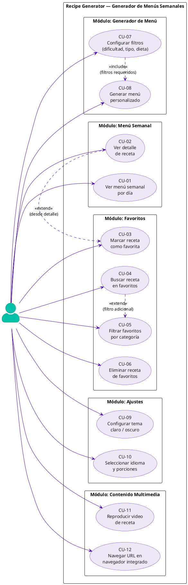
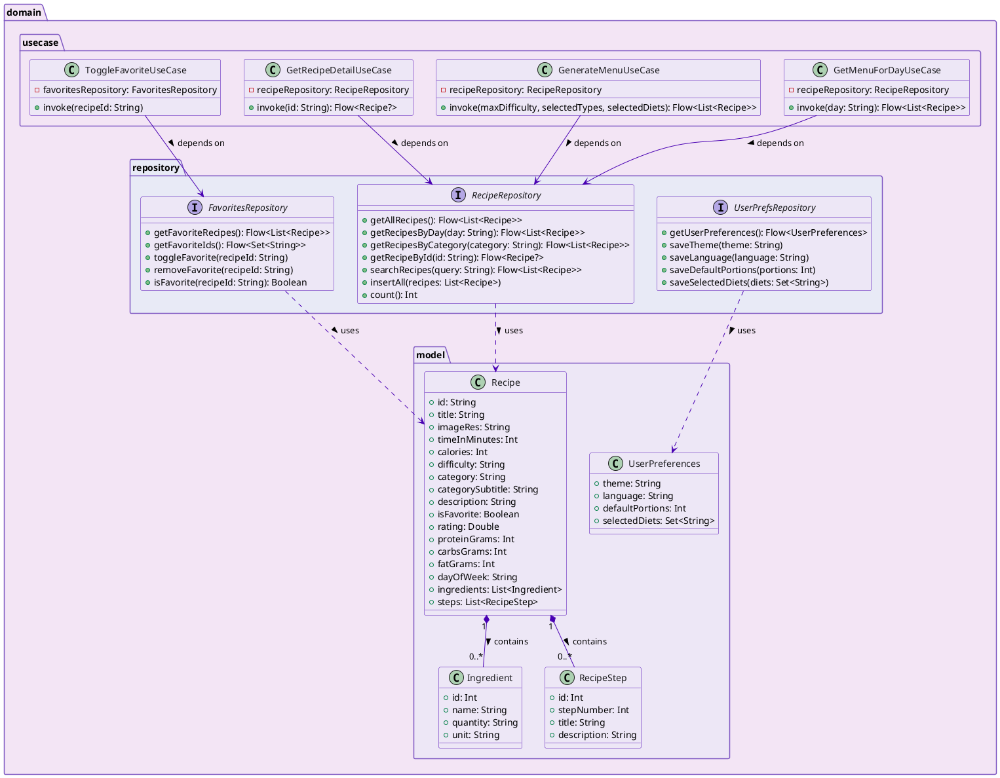
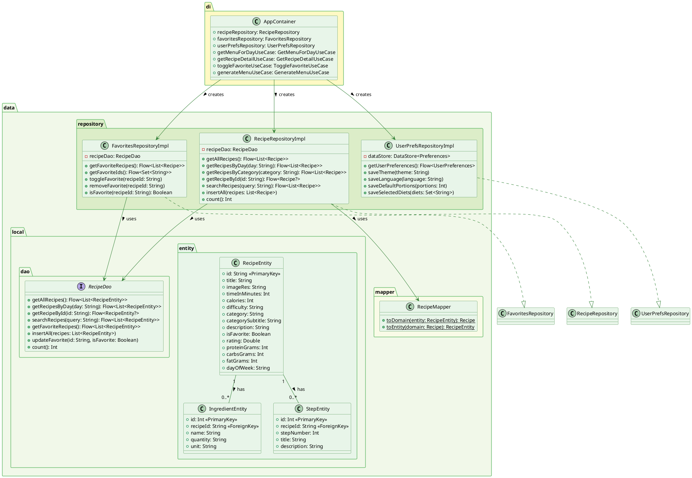
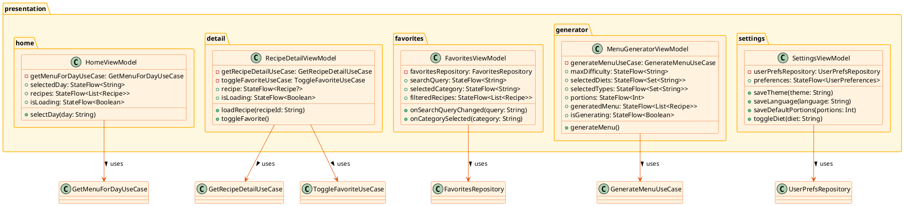

# Recipe Generator — Generador de Menús Semanales

---

## CARÁTULA

**Título de la Aplicación:**
# Recipe Generator — Generador de Menús Semanales

**Materia:** Herramientas de Programación Móvil I

**Institución:** Politécnico Grancolombiano — Bogotá, Colombia

**Programa:** Ingeniería de Sistemas

**Integrantes:**
- Omar Hernández Rey — Cód. 100349113
- Julian David Ortiz Bedoya
- Yonatan Ferney Fernández
- Juan David Rivera Casallas

**Docente:** Jose Ricardo Casallas Triana

**Grupo:** B03

**Fecha:** Marzo 2026

---

## TABLA DE CONTENIDO

1. [Título de la Aplicación](#1-título-de-la-aplicación)
2. [Descripción del Proyecto](#2-descripción-del-proyecto) *(F1-02)*
3. [Objetivo General](#3-objetivo-general) *(F1-03)*
4. [Objetivos Específicos](#4-objetivos-específicos) *(F1-04)*
5. [Requerimientos Funcionales](#5-requerimientos-funcionales) *(F1-05)*
6. [Requerimientos No Funcionales](#6-requerimientos-no-funcionales) *(F1-06)*
7. [Diagrama de Casos de Uso](#7-diagrama-de-casos-de-uso) *(F1-07)*
8. [Diagrama de Clases](#8-diagrama-de-clases) *(F1-08)*
9. [Diagrama de Secuencia](#9-diagrama-de-secuencia) *(F1-09)*
10. [Wireframes / Mockups](#10-wireframes--mockups) *(F1-10)*
11. [Referencias](#referencias)

---

## 1. Título de la Aplicación

**Recipe Generator — Generador de Menús Semanales**

La aplicación recibe el nombre **Recipe Generator**, cuya traducción al español es
**Generador de Menús Semanales**. El título refleja con precisión el propósito central
del sistema: generar, visualizar y gestionar menús de comida para cada día de la semana,
facilitando al usuario la planificación de su alimentación de forma semanal.

El nombre combina dos elementos:

- **Recipe Generator** (inglés técnico): alineado con las convenciones del ecosistema
  Android y del entorno académico de desarrollo de software, donde los nombres de
  proyectos y paquetes se escriben en inglés.
- **Generador de Menús Semanales** (español descriptivo): indica con claridad la
  funcionalidad principal para el usuario hispanohablante, que es el público objetivo
  de la aplicación.

### Identificación técnica del proyecto

| Atributo          | Valor                                      |
|-------------------|--------------------------------------------|
| Nombre completo   | Recipe Generator — Generador de Menús Semanales |
| Nombre técnico    | RecipeGenerator                            |
| Package ID        | `com.example.recipe_generator`             |
| Plataforma        | Android (API 24 — Android 7.0 Nougat en adelante) |
| UI Framework      | Jetpack Compose + Material Design 3        |
| Lenguaje          | Kotlin 2.2.10                              |
| Arquitectura      | MVVM + Clean Architecture (3 capas)        |
| Base de datos     | Room Database (SQLite local)               |
| IDE               | Android Studio Panda 2025.3.2              |

---

---

## 2. Descripción del Proyecto

### 2.1 Propósito

**Recipe Generator — Generador de Menús Semanales** es una aplicación móvil nativa para
Android desarrollada en Kotlin con Jetpack Compose y Material Design 3. Su propósito
principal es ayudar a las personas a planificar su alimentación semanal de forma
organizada, práctica y saludable, proporcionando un conjunto de recetas clasificadas
por día de la semana y por tipo de comida (desayuno, almuerzo y cena).

La aplicación busca resolver un problema cotidiano: la dificultad que enfrentan muchas
personas para decidir qué comer cada día, evitar la repetición de platos, y mantener
una dieta equilibrada sin invertir tiempo excesivo en planificación. A través de una
interfaz intuitiva y visualmente atractiva, el usuario puede explorar recetas, guardar
sus favoritas, generar menús personalizados según sus preferencias y configurar la
aplicación a su gusto.

Adicionalmente, el proyecto tiene un propósito académico: demostrar la aplicación de
conceptos fundamentales del desarrollo de aplicaciones móviles en Android, cubriendo
los lineamientos de formación LF1 a LF8 del módulo **Herramientas de Programación
Móvil I** del Politécnico Grancolombiano, con énfasis en arquitectura MVVM + Clean
Architecture, Jetpack Compose, Room Database y navegación entre pantallas.

### 2.2 Público Objetivo

La aplicación está dirigida a los siguientes perfiles de usuario:

| Perfil | Descripción |
|---|---|
| **Personas activas** | Adultos de 18 a 45 años que buscan comer saludable pero disponen de poco tiempo para planificar su menú diario. |
| **Familias** | Hogares que necesitan organizar las comidas de la semana para toda la familia, con control de ingredientes y porciones. |
| **Estudiantes** | Jóvenes universitarios que viven solos y requieren orientación para preparar comidas variadas y económicas. |
| **Deportistas** | Personas que siguen regímenes alimenticios específicos (alta proteína, baja en carbohidratos, etc.) y necesitan filtrar recetas por criterios nutricionales. |
| **Usuarios con dietas especiales** | Personas vegetarianas, veganas o con restricciones alimentarias que desean filtrar recetas según su tipo de dieta. |

El idioma principal de la interfaz es el **español**, orientado al mercado latinoamericano
y en especial al usuario colombiano, aunque la arquitectura permite agregar soporte
multiidioma (español, inglés, portugués) a través de la pantalla de Ajustes.

El dispositivo objetivo principal es el **Samsung SM-A528B** (Samsung Galaxy A52s 5G),
con Android 7.0 Nougat (API 24) como versión mínima soportada, lo que garantiza
compatibilidad con aproximadamente el **95 % de los dispositivos Android activos** en
el mercado.

### 2.3 Alcance Funcional

La versión 1.0 de **Recipe Generator** contempla las siguientes funcionalidades:

#### Funcionalidades incluidas (en alcance)

| # | Módulo | Descripción |
|---|---|---|
| 1 | **Menú Semanal** | Visualización de recetas organizadas por día (Lunes–Domingo) y tipo de comida (Desayuno, Almuerzo, Cena). |
| 2 | **Detalle de Receta** | Pantalla con imagen hero, información nutricional (calorías, proteínas, carbos, grasas), ingredientes y pasos de preparación. |
| 3 | **Favoritos** | Marcado de recetas favoritas con persistencia local (Room Database). Pantalla con búsqueda por texto y filtro por categoría. |
| 4 | **Generador de Menú** | Generación automática de menús según filtros: dificultad (Slider), tipo de comida (Dropdown) y tipo de dieta (Chips). |
| 5 | **Ajustes** | Configuración de tema claro/oscuro (Switch), idioma (RadioButton group), porciones (Spinner/Dropdown) y dietas (Checkbox). |
| 6 | **Menú lateral** | Panel izquierdo con accesos directos: Perfil, Fotos, Video, Navegador web y pantalla de Controles. |
| 7 | **Perfil de usuario** | Pantalla con imagen local e información del perfil (sin autenticación en v1.0). |
| 8 | **Galería de fotos** | LazyColumn de imágenes locales con descripción al seleccionar. |
| 9 | **Reproductor de video** | Pantalla con `VideoView` (AndroidView) para reproducción de video local con `MediaController`. |
| 10 | **Navegador web** | Pantalla con `WebView` (AndroidView), campo de URL y barra de progreso. |
| 11 | **Controles LF8** | Pantalla de demostración con todos los controles requeridos: Button, IconButton, Checkbox, RadioButton, Switch, Dropdown (Spinner), LazyColumn (ListView). |
| 12 | **Widget de escritorio** | Widget nativo Android (AppWidgetProvider) que muestra la receta del día con botón para abrir la app. |

#### Funcionalidades fuera de alcance (v1.0)

- Autenticación de usuarios (login / registro).
- Sincronización con backend en la nube o servidor externo.
- Compra de ingredientes en línea o integración con supermercados.
- Notificaciones push programadas.
- Cámara para fotografiar platos propios.
- Reconocimiento de ingredientes mediante inteligencia artificial.

### 2.4 Stack Tecnológico

El proyecto se desarrolla con la siguiente pila tecnológica, aprobada por el docente:

| Capa | Tecnología |
|---|---|
| Lenguaje | Kotlin 2.2.10 |
| UI | Jetpack Compose + Material Design 3 |
| Arquitectura | MVVM + Clean Architecture (Presentation / Domain / Data) |
| Navegación | Navigation Component — `navController.navigate()` |
| Base de datos | Room Database (SQLite local) |
| Persistencia liviana | DataStore Preferences |
| Estado | `StateFlow` + `collectAsStateWithLifecycle()` |
| Concurrencia | Kotlin Coroutines + Flow (`viewModelScope`) |
| Build | Gradle Kotlin DSL + Version Catalog (`libs.versions.toml`) |
| SDK mínimo | API 24 — Android 7.0 Nougat |
| SDK objetivo | API 35 — Android 15 |
| IDE | Android Studio Panda 2025.3.2 |

---

## 3. Objetivo General

**Desarrollar** una aplicación móvil nativa para Android denominada
*Recipe Generator — Generador de Menús Semanales*, **mediante** la implementación
de Jetpack Compose con Material Design 3, arquitectura MVVM + Clean Architecture,
Room Database y Navigation Component, **con el fin de** proporcionar a los usuarios
una herramienta digital intuitiva que les permita planificar, visualizar y personalizar
sus menús alimenticios semanales de forma local, eficiente y sin dependencia de
servicios externos.

### Desglose estructural del objetivo general

La formulación del objetivo sigue la estructura académica estándar:

| Componente | Contenido |
|---|---|
| **Verbo infinitivo** | Desarrollar |
| **Qué** | Una aplicación móvil nativa para Android — *Recipe Generator* |
| **Cómo** | Mediante Jetpack Compose + Material Design 3, arquitectura MVVM + Clean Architecture (3 capas: Presentation / Domain / Data), Room Database como fuente de verdad local, Navigation Component para la navegación entre pantallas, StateFlow + Coroutines para el manejo del estado, y DataStore Preferences para la persistencia de configuración |
| **Para qué** | Proporcionar a los usuarios una herramienta que les permita planificar, explorar y personalizar sus menús semanales (Lunes–Domingo) de forma organizada, saludable y completamente offline |

### Justificación del objetivo

La selección de **Jetpack Compose** como framework de UI responde a la aprobación
explícita del docente y al hecho de ser la tecnología oficial recomendada por Google
para el desarrollo moderno de interfaces en Android. Este framework permite cumplir
íntegramente los lineamientos LF1 a LF8 del módulo mediante estrategias de
compatibilidad documentadas en la tabla de equivalencias del Plan Maestro v3.0
(Actividades, Fragmentos con `ComposeView`, `AndroidView{}` para controles
específicos, `LazyColumn` como equivalente de `ListView`, entre otros).

La elección de **Room Database** garantiza persistencia de datos completamente local
y sin dependencia de backend externo, lo cual es coherente con el alcance definido
para la versión 1.0 de la aplicación.

---

## 4. Objetivos Específicos

Los siguientes cinco objetivos específicos son medibles, alcanzables y están
alineados directamente con los lineamientos de formación LF1 a LF8 del módulo
*Herramientas de Programación Móvil I*.

---

### OE-01 — Implementar la arquitectura MVVM + Clean Architecture *(LF1, LF2)*

**Implementar** la arquitectura MVVM + Clean Architecture en tres capas
(Presentation, Domain, Data) **mediante** la definición de ViewModels con
`StateFlow`, casos de uso en la capa Domain, repositorios con interfaces e
implementaciones en la capa Data, y un contenedor de inyección de dependencias
manual (`AppContainer`) en la clase `Application`, **con el fin de** garantizar
una separación de responsabilidades clara, código mantenible y testeable que
demuestre el dominio de los principios de arquitectura de aplicaciones Android
modernas establecidos en LF1 y LF2.

**Indicador de cumplimiento:** La aplicación compila sin errores, las tres capas
están correctamente delimitadas en paquetes (`presentation/`, `domain/`, `data/`),
y cada ViewModel expone su estado únicamente a través de `StateFlow` inmutable.

---

### OE-02 — Construir la interfaz de usuario con Jetpack Compose y Material Design 3 *(LF3, LF4)*

**Construir** todas las pantallas de la aplicación (Menú Semanal, Detalle de Receta,
Favoritos, Generador de Menú, Ajustes y panel lateral) **mediante** Jetpack Compose
con componentes de Material Design 3 (`Scaffold`, `LazyColumn`, `LazyVerticalGrid`,
`NavigationBar`, `Card`, `TopAppBar`) y manejo de estado local con
`remember { mutableStateOf() }`, **con el fin de** ofrecer una interfaz moderna,
responsiva y consistente que cubra íntegramente los lineamientos LF3 (layouts e
interfaz) y LF4 (app interactiva con estado).

**Indicador de cumplimiento:** Cada pantalla está implementada como `@Composable`,
responde correctamente a las interacciones del usuario, y el estado visual se
actualiza de forma reactiva sin requerir `invalidate()` ni `notifyDataSetChanged()`.

---

### OE-03 — Integrar controles de interfaz requeridos por el módulo *(LF7, LF8)*

**Integrar** en la aplicación todos los controles de interfaz exigidos por los
lineamientos LF7 y LF8 **mediante** el uso de sus equivalentes modernos en
Jetpack Compose (`Slider` por `SeekBar`, `LazyColumn` por `ListView`,
`ExposedDropdownMenuBox` por `Spinner`, `Switch`, `Checkbox`, `RadioButton`,
`Button`, `IconButton`) y el uso de `AndroidView{}` para incrustar controles
nativos como `VideoView` y `WebView` dentro de Composables, **con el fin de**
demostrar el dominio y la equivalencia funcional entre los controles del framework
XML tradicional y el paradigma declarativo de Compose.

**Indicador de cumplimiento:** La pantalla `ControlsScreen` exhibe y responde
correctamente a todos los controles listados; `VideoScreen` reproduce video local
y `WebScreen` carga URLs mediante `WebView`; cada control genera una respuesta
visible en la UI al interactuar con él.

---

### OE-04 — Implementar navegación entre actividades y fragmentos *(LF5, LF6)*

**Implementar** la navegación completa de la aplicación **mediante** una
`MainActivity` como Single Activity host con `NavHost` de Navigation Compose,
una segunda actividad `RecipeDetailActivity` lanzada con `Intent.putExtra(recipeId)`
para el detalle de receta, y cada pantalla principal alojada en un `Fragment`
con `ComposeView` como host de la UI Compose, **con el fin de** cumplir
explícitamente los lineamientos LF5 (ciclo de vida de actividades, back stack,
`Intent` y `Bundle`) y LF6 (gestión de fragmentos con `FragmentManager`,
`replace()` y `addToBackStack()`).

**Indicador de cumplimiento:** La aplicación navega correctamente entre las
4 pestañas del `NavigationBar`, lanza `RecipeDetailActivity` al seleccionar
una receta, permite regresar con el botón Back, y el `FragmentManager`
gestiona el back stack de fragmentos sin fugas de memoria.

---

### OE-05 — Persistir datos localmente con Room Database y DataStore *(LF1, LF2)*

**Persistir** todas las recetas, favoritos y preferencias del usuario
**mediante** Room Database (SQLite local) para las entidades `RecipeEntity`,
`IngredientEntity` y `StepEntity`, y DataStore Preferences para la
configuración de tema, idioma, porciones y dietas, **con el fin de** garantizar
que la aplicación funcione completamente offline, que los favoritos y ajustes
del usuario se conserven entre sesiones, y que la capa de datos cumpla los
principios de fuente única de verdad (*Single Source of Truth*) del módulo.

**Indicador de cumplimiento:** Las 21 recetas (7 días × 3 comidas) se almacenan
en Room al primer inicio mediante `DatabaseSeeder`; marcar una receta como favorita
persiste en la base de datos y aparece en `FavoritesScreen` al relanzar la app;
los ajustes guardados en DataStore se restauran correctamente al reiniciar.

---

### Tabla resumen de objetivos específicos

| ID | Verbo | Qué | Cómo | LF cubierto |
|---|---|---|---|---|
| OE-01 | Implementar | Arquitectura MVVM + Clean Architecture | ViewModels, StateFlow, UseCases, AppContainer | LF1, LF2 |
| OE-02 | Construir | UI con Compose + Material Design 3 | Composables, Scaffold, LazyColumn, remember | LF3, LF4 |
| OE-03 | Integrar | Controles requeridos por el módulo | Slider, LazyColumn, Dropdown, AndroidView | LF7, LF8 |
| OE-04 | Implementar | Navegación entre Activities y Fragments | NavHost, Intent, Fragment + ComposeView | LF5, LF6 |
| OE-05 | Persistir | Datos locales con Room y DataStore | Room DB (21 recetas), DataStore Preferences | LF1, LF2 |

---

## 5. Requerimientos Funcionales

Los requerimientos funcionales describen las capacidades y comportamientos que el
sistema **debe** proporcionar al usuario. Cada requerimiento está identificado con
el código **RF-XX**, su nombre, descripción, prioridad y la pantalla donde se
implementa.

**Escala de prioridad:** Alta — el sistema no puede funcionar sin este RF.
Media — mejora significativa de la experiencia. Baja — funcionalidad complementaria.

---

### RF-01 — Ver menú semanal por día

| Atributo | Detalle |
|---|---|
| **ID** | RF-01 |
| **Nombre** | Ver menú semanal por día |
| **Descripción** | El sistema debe mostrar las recetas del día seleccionado (Lunes a Domingo), organizadas por tipo de comida: Desayuno, Almuerzo y Cena. El usuario puede cambiar de día mediante un selector de pestañas horizontal. |
| **Actor** | Usuario |
| **Pantalla** | `RecipeListScreen` (Inicio) |
| **Prioridad** | Alta |
| **Criterio de aceptación** | Al seleccionar un día en el tab layout, la lista de recetas se actualiza automáticamente mostrando únicamente las 3 recetas (o las disponibles) del día elegido. |

---

### RF-02 — Buscar receta en favoritos

| Atributo | Detalle |
|---|---|
| **ID** | RF-02 |
| **Nombre** | Buscar receta por texto |
| **Descripción** | El sistema debe permitir al usuario filtrar las recetas guardadas como favoritas mediante un campo de búsqueda de texto libre. La búsqueda aplica sobre el título y la descripción de la receta en tiempo real. |
| **Actor** | Usuario |
| **Pantalla** | `FavoritesScreen` |
| **Prioridad** | Alta |
| **Criterio de aceptación** | Al escribir en el campo de búsqueda, la lista se filtra en tiempo real mostrando únicamente las recetas cuyos títulos o descripciones contienen el texto ingresado. Si no hay coincidencias, se muestra un estado vacío informativo. |

---

### RF-03 — Ver detalle completo de una receta

| Atributo | Detalle |
|---|---|
| **ID** | RF-03 |
| **Nombre** | Ver detalle de receta |
| **Descripción** | El sistema debe mostrar una pantalla de detalle al seleccionar una receta, con imagen hero, título, descripción, información nutricional (calorías, proteínas, carbohidratos, grasas), lista de ingredientes y pasos de preparación numerados. |
| **Actor** | Usuario |
| **Pantalla** | `RecipeDetailScreen` / `RecipeDetailActivity` |
| **Prioridad** | Alta |
| **Criterio de aceptación** | La pantalla de detalle muestra todos los campos de la receta. Los pasos de preparación se presentan en orden numérico. El usuario puede regresar a la pantalla anterior mediante el botón de retroceso. |

---

### RF-04 — Marcar y desmarcar receta como favorita

| Atributo | Detalle |
|---|---|
| **ID** | RF-04 |
| **Nombre** | Toggle de favorito |
| **Descripción** | El sistema debe permitir al usuario marcar o desmarcar cualquier receta como favorita desde la pantalla de lista o desde el detalle. El estado de favorito debe persistir localmente entre sesiones. |
| **Actor** | Usuario |
| **Pantalla** | `RecipeListScreen`, `RecipeDetailScreen`, `FavoritesScreen` |
| **Prioridad** | Alta |
| **Criterio de aceptación** | Al presionar el ícono de favorito, el estado cambia visualmente de forma inmediata (ícono relleno / vacío). Al cerrar y reabrir la app, el estado de favorito se conserva. La receta aparece o desaparece de `FavoritesScreen` según corresponda. |

---

### RF-05 — Filtrar favoritos por categoría

| Atributo | Detalle |
|---|---|
| **ID** | RF-05 |
| **Nombre** | Filtrar favoritos por categoría |
| **Descripción** | El sistema debe permitir filtrar las recetas favoritas por categoría de comida (Todos, Desayuno, Almuerzo, Cena) mediante chips de selección horizontal. |
| **Actor** | Usuario |
| **Pantalla** | `FavoritesScreen` |
| **Prioridad** | Media |
| **Criterio de aceptación** | Al seleccionar un chip de categoría, la cuadrícula de favoritos muestra únicamente las recetas de esa categoría. Al seleccionar "Todos", se muestran todas las recetas favoritas. |

---

### RF-06 — Generar menú personalizado

| Atributo | Detalle |
|---|---|
| **ID** | RF-06 |
| **Nombre** | Generar menú con filtros |
| **Descripción** | El sistema debe permitir al usuario configurar parámetros (nivel de dificultad mediante un Slider, tipo de comida mediante un Dropdown, tipo de dieta mediante Chips) y generar un menú filtrado al presionar el botón "Generar Menú". |
| **Actor** | Usuario |
| **Pantalla** | `MenuGeneratorScreen` |
| **Prioridad** | Alta |
| **Criterio de aceptación** | Al presionar "Generar Menú", el sistema consulta la base de datos y muestra en una `LazyColumn` las recetas que cumplen con todos los filtros seleccionados. Si no hay resultados, muestra un mensaje informativo. |

---

### RF-07 — Configurar preferencias de la aplicación

| Atributo | Detalle |
|---|---|
| **ID** | RF-07 |
| **Nombre** | Configurar ajustes |
| **Descripción** | El sistema debe permitir al usuario configurar: tema visual (claro/oscuro) mediante Switch, idioma (Español/Inglés/Portugués) mediante RadioButton group, número de porciones (1–10) mediante ExposedDropdownMenu, y tipos de dieta mediante Checkbox. Los cambios deben persistir con DataStore. |
| **Actor** | Usuario |
| **Pantalla** | `SettingsScreen` |
| **Prioridad** | Media |
| **Criterio de aceptación** | Los cambios en el tema se aplican de forma inmediata en toda la app. Al reiniciar la aplicación, las preferencias guardadas se restauran correctamente desde DataStore. |

---

### RF-08 — Reproducir video de receta

| Atributo | Detalle |
|---|---|
| **ID** | RF-08 |
| **Nombre** | Reproducir video |
| **Descripción** | El sistema debe mostrar una pantalla con un reproductor de video (`VideoView` dentro de `AndroidView`) con controles de reproducción (`MediaController`): play, pause, barra de progreso y control de volumen. |
| **Actor** | Usuario |
| **Pantalla** | `VideoScreen` |
| **Prioridad** | Media |
| **Criterio de aceptación** | El video se reproduce correctamente desde un recurso local. Los controles de reproducción responden a las interacciones del usuario. El video se pausa automáticamente al salir de la pantalla (`DisposableEffect`). |

---

### RF-09 — Navegar a URL en navegador integrado

| Atributo | Detalle |
|---|---|
| **ID** | RF-09 |
| **Nombre** | Navegador web integrado |
| **Descripción** | El sistema debe proporcionar una pantalla con un campo de texto para ingresar una URL, un botón para navegar, y un `WebView` (dentro de `AndroidView`) que cargue la página. Debe mostrar una barra de progreso lineal mientras carga. |
| **Actor** | Usuario |
| **Pantalla** | `WebScreen` |
| **Prioridad** | Media |
| **Criterio de aceptación** | Al ingresar una URL válida y presionar "Ir", el `WebView` carga la página. La barra de progreso se muestra durante la carga y desaparece al completarse. JavaScript está habilitado. |

---

### RF-10 — Mostrar galería de fotos de recetas

| Atributo | Detalle |
|---|---|
| **ID** | RF-10 |
| **Nombre** | Galería de fotos |
| **Descripción** | El sistema debe mostrar una pantalla con una `LazyColumn` de imágenes locales de recetas. Al seleccionar una imagen, debe mostrarse su título y descripción en un `Text` inferior con una animación de selección. |
| **Actor** | Usuario |
| **Pantalla** | `PhotosScreen` |
| **Prioridad** | Media |
| **Criterio de aceptación** | La galería muestra mínimo 5 imágenes locales. Al seleccionar una, la descripción se actualiza con animación. El estado de selección se mantiene mientras el usuario navega por la lista. |

---

### RF-11 — Mostrar widget de receta del día en el escritorio

| Atributo | Detalle |
|---|---|
| **ID** | RF-11 |
| **Nombre** | Widget de escritorio |
| **Descripción** | El sistema debe proveer un widget de Android Home Screen que muestre el título de la receta del día y un botón que abra la aplicación directamente en el detalle de esa receta. El widget se actualiza periódicamente. |
| **Actor** | Usuario |
| **Pantalla** | `RecipeWidgetProvider` (AppWidgetProvider) |
| **Prioridad** | Baja |
| **Criterio de aceptación** | El widget aparece disponible en el menú de widgets del launcher. Muestra el nombre de la receta del día. Al presionar el botón, abre la app. Se actualiza según el `updatePeriodMillis` configurado. |

---

### RF-12 — Demostrar controles de interfaz requeridos por el módulo

| Atributo | Detalle |
|---|---|
| **ID** | RF-12 |
| **Nombre** | Pantalla de controles LF8 |
| **Descripción** | El sistema debe incluir una pantalla que exhiba y haga funcionar todos los controles exigidos por LF8: Button, IconButton (ImageButton), Checkbox, RadioButton group (RadioGroup), Switch (ToggleButton), ExposedDropdownMenuBox (Spinner), LazyColumn (ListView) con scroll. Al presionar "Confirmar", todos los valores seleccionados se muestran en un Text. |
| **Actor** | Evaluador / Docente |
| **Pantalla** | `ControlsScreen` |
| **Prioridad** | Alta |
| **Criterio de aceptación** | Todos los controles responden correctamente a la interacción. El texto de resultado refleja el estado actual de cada control. La pantalla hace scroll cuando el contenido supera la altura de la pantalla. |

---

### Tabla resumen de Requerimientos Funcionales

| ID | Nombre | Pantalla | Prioridad | LF |
|---|---|---|---|---|
| RF-01 | Ver menú semanal por día | RecipeListScreen | Alta | LF3, LF8 |
| RF-02 | Buscar receta por texto | FavoritesScreen | Alta | LF4, LF8 |
| RF-03 | Ver detalle de receta | RecipeDetailScreen | Alta | LF5, LF7 |
| RF-04 | Toggle de favorito | RecipeListScreen, Detail | Alta | LF4, LF8 |
| RF-05 | Filtrar favoritos por categoría | FavoritesScreen | Media | LF8 |
| RF-06 | Generar menú con filtros | MenuGeneratorScreen | Alta | LF7, LF8 |
| RF-07 | Configurar ajustes | SettingsScreen | Media | LF8 |
| RF-08 | Reproducir video | VideoScreen | Media | LF7 |
| RF-09 | Navegador web integrado | WebScreen | Media | LF7 |
| RF-10 | Galería de fotos | PhotosScreen | Media | LF7, LF8 |
| RF-11 | Widget de escritorio | RecipeWidgetProvider | Baja | LF7 |
| RF-12 | Pantalla de controles LF8 | ControlsScreen | Alta | LF8 |

---

## 6. Requerimientos No Funcionales

Los requerimientos no funcionales (RNF) definen los atributos de calidad que el
sistema debe cumplir: cómo debe comportarse, no qué debe hacer. Están organizados
por categoría de calidad según el estándar ISO/IEC 25010 (Calidad del Producto de
Software).

---

### 6.1 Rendimiento

| ID | Requerimiento | Métrica |
|---|---|---|
| **RNF-01** | La aplicación debe iniciar completamente (splash → pantalla de inicio con recetas visibles) en un tiempo menor a **3 segundos** en el dispositivo Samsung SM-A528B con Android 12. | Tiempo medido desde el toque del ícono hasta que `RecipeListScreen` es interactuable. |
| **RNF-02** | La transición entre pantallas (navegación entre tabs del `NavigationBar`) debe completarse en menos de **300 milisegundos**, garantizando una experiencia fluida a 60 fps. | Medido con Android Profiler — Frame rendering time < 16 ms por fotograma. |
| **RNF-03** | La consulta a Room Database (obtener recetas del día) debe completarse en menos de **100 milisegundos** en dispositivos con API 24 o superior. | Verificado con Room Query instrumentation tests. |
| **RNF-04** | La generación de menú personalizado (`GenerateMenuUseCase`) debe retornar resultados en menos de **500 milisegundos** independientemente del número de filtros aplicados. | Medido en test unitario con Room In-Memory Database. |

---

### 6.2 Seguridad

| ID | Requerimiento | Métrica |
|---|---|---|
| **RNF-05** | Todos los datos del usuario (favoritos, preferencias) deben almacenarse **únicamente en el dispositivo local**, sin transmisión a servidores externos ni servicios de analítica de terceros. | Verificación mediante análisis de tráfico de red: la app no realiza ninguna petición HTTP en condiciones de uso normal. |
| **RNF-06** | La aplicación debe cumplir con el principio de **mínimos permisos**: solicitar únicamente el permiso `INTERNET` (requerido para `WebView`) y ningún otro permiso sensible (cámara, contactos, ubicación, micrófono). | Revisión del `AndroidManifest.xml`: máximo 1 permiso declarado. |
| **RNF-07** | Los datos persistidos en Room Database no deben contener información personal identificable (PII) del usuario. El perfil de usuario es estático y definido en código fuente, no ingresado por el usuario. | Revisión de esquema de base de datos: ninguna tabla contiene campos de nombre, correo, contraseña ni datos biométricos. |
| **RNF-08** | El `WebView` debe habilitar `WebViewClient` personalizado para controlar la navegación y evitar redirecciones a URLs maliciosas externas fuera de la intención del usuario. | El `WebViewClient` intercepta `shouldOverrideUrlLoading` y mantiene la navegación dentro del componente. |

---

### 6.3 Usabilidad

| ID | Requerimiento | Métrica |
|---|---|---|
| **RNF-09** | La interfaz debe seguir las guías de **Material Design 3** en todos los componentes: colores del tema (`Primary #4800B2`, `Secondary #00C2A8`, `Tertiary #FF0081`), tipografía, espaciado y formas redondeadas definidos en `AppTheme.kt`. | Revisión visual contra la paleta de colores y componentes M3 documentados. |
| **RNF-10** | Todos los elementos interactivos (botones, chips, ítems de lista) deben tener un área táctil mínima de **48 × 48 dp**, cumpliendo las directrices de accesibilidad de Android. | Revisión con el inspector de layouts de Android Studio. |
| **RNF-11** | La aplicación debe soportar **modo claro y modo oscuro** de forma completa, aplicando el tema correspondiente en todos los Composables sin textos ni fondos hardcodeados con colores absolutos. | Verificación visual en ambos modos con Android Studio Preview y en dispositivo físico. |
| **RNF-12** | La navegación debe ser **intuitiva y consistente**: la `NavigationBar` debe estar visible en todas las pantallas principales, el ícono activo debe resaltarse visualmente, y el botón de retroceso debe funcionar correctamente en toda la jerarquía de navegación. | Prueba de navegación manual recorriendo todos los destinos y verificando el estado activo del tab. |

---

### 6.4 Portabilidad

| ID | Requerimiento | Métrica |
|---|---|---|
| **RNF-13** | La aplicación debe ejecutarse correctamente en dispositivos Android con **API 24 (Android 7.0 Nougat) o superior**, cubriendo aproximadamente el 95 % de los dispositivos Android activos en el mercado. | `minSdk = 24` configurado en `build.gradle.kts`. Prueba en AVD con API 24. |
| **RNF-14** | La interfaz debe adaptarse correctamente a diferentes tamaños de pantalla: teléfonos (360 dp – 480 dp de ancho) y tabletas (600 dp o más), utilizando layouts responsivos con `LazyVerticalGrid` y `AdaptiveCells`. | Verificación en AVD con tamaños de pantalla 5" (1080×1920) y 10" (1200×1920). |
| **RNF-15** | La aplicación debe compilar y ejecutarse sin modificaciones en **Android Studio Panda 2025.3.2** con JDK 25.0.2, SDK API 35 y Kotlin 2.2.10. | Compilación exitosa con `./gradlew assembleDebug` sin errores ni warnings críticos. |

---

### 6.5 Mantenibilidad

| ID | Requerimiento | Métrica |
|---|---|---|
| **RNF-16** | El código fuente debe seguir la arquitectura **MVVM + Clean Architecture** con separación estricta en tres capas (`presentation/`, `domain/`, `data/`), sin que la capa de dominio importe clases de Android Framework. | Verificación estática: ningún archivo en `domain/` importa `android.*`. |
| **RNF-17** | Cada pantalla debe tener su propio **ViewModel** que exponga el estado mediante `StateFlow` inmutable, sin que la UI acceda directamente a repositorios o bases de datos. | Revisión de código: los Composables solo importan clases del paquete `presentation/` y el modelo de dominio. |
| **RNF-18** | El proyecto debe gestionar sus dependencias mediante **Gradle Version Catalog** (`libs.versions.toml`), evitando versiones hardcodeadas en los archivos `build.gradle.kts`. | Revisión de `build.gradle.kts`: todas las dependencias usan `libs.*` del catálogo. |

---

### 6.6 Confiabilidad

| ID | Requerimiento | Métrica |
|---|---|---|
| **RNF-19** | La aplicación **no debe cerrarse inesperadamente** (crash) durante el flujo principal de uso: navegar entre pantallas, marcar favoritos, generar menú y configurar ajustes. | Cero crashes en 30 minutos de uso continuo en el dispositivo Samsung SM-A528B. |
| **RNF-20** | Las operaciones de lectura y escritura en Room Database deben ejecutarse en **hilos de fondo** (Coroutines con `Dispatchers.IO`) para no bloquear el hilo principal de la UI. | Ninguna operación de Room se llama desde el hilo principal; uso exclusivo de `viewModelScope.launch {}`. |

---

### Tabla resumen de Requerimientos No Funcionales

| ID | Categoría | Nombre resumido |
|---|---|---|
| RNF-01 | Rendimiento | Inicio < 3 segundos |
| RNF-02 | Rendimiento | Transición < 300 ms a 60 fps |
| RNF-03 | Rendimiento | Consulta Room < 100 ms |
| RNF-04 | Rendimiento | Generación de menú < 500 ms |
| RNF-05 | Seguridad | Datos solo en dispositivo local (sin backend) |
| RNF-06 | Seguridad | Mínimos permisos (solo INTERNET) |
| RNF-07 | Seguridad | Sin PII en base de datos |
| RNF-08 | Seguridad | WebViewClient personalizado |
| RNF-09 | Usabilidad | Material Design 3 en toda la UI |
| RNF-10 | Usabilidad | Área táctil mínima 48×48 dp |
| RNF-11 | Usabilidad | Modo claro y oscuro completo |
| RNF-12 | Usabilidad | Navegación intuitiva y consistente |
| RNF-13 | Portabilidad | API 24+ (95 % de dispositivos) |
| RNF-14 | Portabilidad | Responsivo: teléfono y tableta |
| RNF-15 | Portabilidad | Compila en Android Studio Panda 2025.3.2 |
| RNF-16 | Mantenibilidad | Clean Architecture sin cruces de capas |
| RNF-17 | Mantenibilidad | ViewModel + StateFlow por pantalla |
| RNF-18 | Mantenibilidad | Gradle Version Catalog |
| RNF-19 | Confiabilidad | Cero crashes en flujo principal |
| RNF-20 | Confiabilidad | Room en hilos de fondo (Coroutines) |

---

## 7. Diagrama de Casos de Uso UML

### 7.1 Descripción general

El diagrama de casos de uso representa las interacciones entre el actor principal
(**Usuario**) y las funcionalidades del sistema **Recipe Generator**. Se identifican
**12 casos de uso** agrupados en 5 módulos funcionales, que cubren la totalidad de
los requerimientos funcionales RF-01 a RF-12.

**Actor principal:** Usuario — persona que interactúa con la aplicación móvil a
través de la pantalla táctil del dispositivo Android.

**Sistema:** Recipe Generator — Generador de Menús Semanales (`com.example.recipe_generator`).

---

### 7.2 Diagrama PlantUML

> Para renderizar el diagrama, pegar el código en [https://www.plantuml.com/plantuml/uml](https://www.plantuml.com/plantuml/uml)
> o usar la extensión PlantUML de VS Code / IntelliJ.



---

### 7.3 Representación textual del diagrama

```
┌─────────────────────────────────────────────────────────────────────────────┐
│              Recipe Generator — Generador de Menús Semanales                │
│                                                                             │
│  ┌──── Módulo: Menú Semanal ──────┐  ┌──── Módulo: Favoritos ────────────┐  │
│  │  (CU-01) Ver menú por día      │  │  (CU-03) Marcar como favorita    │  │
│  │  (CU-02) Ver detalle receta    │  │  (CU-04) Buscar en favoritos     │  │
│  └────────────────────────────────┘  │  (CU-05) Filtrar por categoría   │  │
│                                      │  (CU-06) Eliminar de favoritos   │  │
│  ┌──── Módulo: Generador ─────────┐  └──────────────────────────────────┘  │
│  │  (CU-07) Configurar filtros    │                                         │
│  │  (CU-08) Generar menú          │  ┌──── Módulo: Ajustes ──────────────┐  │
│  └────────────────────────────────┘  │  (CU-09) Tema claro/oscuro       │  │
│                                      │  (CU-10) Idioma y porciones      │  │
│  ┌──── Módulo: Multimedia ────────┐  └──────────────────────────────────┘  │
│  │  (CU-11) Reproducir video      │                                         │
│  │  (CU-12) Navegar URL web       │                                         │
│  └────────────────────────────────┘                                         │
└─────────────────────────────────────────────────────────────────────────────┘
                              ▲ asociación ▲
                         ┌────┴────┐
                         │ Usuario │
                         └─────────┘
```

---

### 7.4 Descripción de cada Caso de Uso

| ID | Caso de Uso | Actor | Pantalla | RF asociado |
|---|---|---|---|---|
| CU-01 | Ver menú semanal por día | Usuario | RecipeListScreen | RF-01 |
| CU-02 | Ver detalle de receta | Usuario | RecipeDetailScreen | RF-03 |
| CU-03 | Marcar receta como favorita | Usuario | RecipeListScreen, Detail | RF-04 |
| CU-04 | Buscar receta en favoritos | Usuario | FavoritesScreen | RF-02 |
| CU-05 | Filtrar favoritos por categoría | Usuario | FavoritesScreen | RF-05 |
| CU-06 | Eliminar receta de favoritos | Usuario | FavoritesScreen | RF-04 |
| CU-07 | Configurar filtros del generador | Usuario | MenuGeneratorScreen | RF-06 |
| CU-08 | Generar menú personalizado | Usuario | MenuGeneratorScreen | RF-06 |
| CU-09 | Configurar tema claro/oscuro | Usuario | SettingsScreen | RF-07 |
| CU-10 | Seleccionar idioma y porciones | Usuario | SettingsScreen | RF-07 |
| CU-11 | Reproducir video de receta | Usuario | VideoScreen | RF-08 |
| CU-12 | Navegar URL en navegador integrado | Usuario | WebScreen | RF-09 |

### 7.5 Relaciones entre casos de uso

| Relación | Tipo | Descripción |
|---|---|---|
| CU-02 → CU-03 | `<<extend>>` | Desde el detalle de receta el usuario **puede** marcar como favorita (extensión opcional). |
| CU-07 → CU-08 | `<<include>>` | Para generar el menú (CU-08) es **obligatorio** configurar los filtros (CU-07) previamente. |
| CU-04 → CU-05 | `<<extend>>` | El filtro por categoría (CU-05) es una extensión opcional de la búsqueda (CU-04). |

---

## 8. Diagrama de Clases UML

### 8.1 Descripción general

El diagrama de clases refleja la estructura real del código fuente del proyecto,
organizado en las tres capas de **Clean Architecture**:

- **Domain** — modelos de negocio puros e interfaces de repositorios (sin dependencias Android).
- **Data** — entidades Room, DAOs, implementaciones de repositorios y mappers.
- **Presentation** — ViewModels con StateFlow que consumen los casos de uso.

> Para renderizar el diagrama, pegar el código en [https://www.plantuml.com/plantuml/uml](https://www.plantuml.com/plantuml/uml)

---

### 8.2 Diagrama PlantUML — Capa Domain



---

### 8.3 Diagrama PlantUML — Capa Data



---

### 8.4 Diagrama PlantUML — Capa Presentation (ViewModels)



---

### 8.5 Resumen de clases por capa

| Capa | Tipo | Clases / Interfaces |
|---|---|---|
| **Domain — Models** | `data class` | `Recipe`, `Ingredient`, `RecipeStep`, `UserPreferences` |
| **Domain — Repositories** | `interface` | `RecipeRepository`, `FavoritesRepository`, `UserPrefsRepository` |
| **Domain — Use Cases** | `class` | `GetMenuForDayUseCase`, `GetRecipeDetailUseCase`, `ToggleFavoriteUseCase`, `GenerateMenuUseCase` |
| **Data — Entities** | `@Entity` | `RecipeEntity`, `IngredientEntity`, `StepEntity` |
| **Data — DAOs** | `@Dao interface` | `RecipeDao` |
| **Data — Repositories** | `class` | `RecipeRepositoryImpl`, `FavoritesRepositoryImpl`, `UserPrefsRepositoryImpl` |
| **Data — Mapper** | `object` | `RecipeMapper` |
| **DI** | `class` | `AppContainer` |
| **Presentation** | `ViewModel` | `HomeViewModel`, `RecipeDetailViewModel`, `FavoritesViewModel`, `MenuGeneratorViewModel`, `SettingsViewModel` |

*Las secciones siguientes se completan en las tareas F1-09 y F1-10.*

---

## Referencias

Google LLC. (2024). *Jetpack Compose — Android Developers*.
https://developer.android.com/jetpack/compose

Google LLC. (2024). *Material Design 3 for Android*.
https://m3.material.io/develop/android/jetpack-compose

Google LLC. (2024). *Guide to app architecture — Android Developers*.
https://developer.android.com/topic/architecture

Politécnico Grancolombiano. (2026). *Plan Maestro Recipe Generator v3.0 —
Herramientas de Programación Móvil I*. Bogotá, Colombia.
